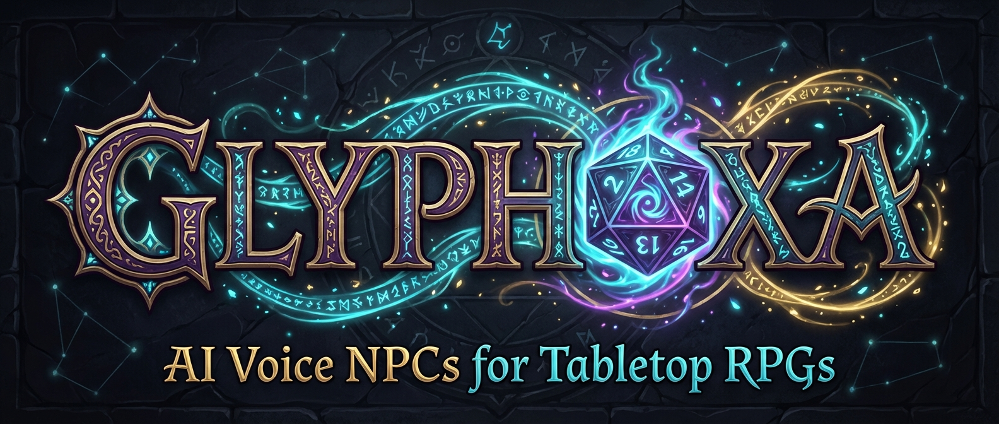

# 🐉 Glyphoxa

[](https://github.com/MrWong99/glyphoxa/actions/workflows/ci.yml)
[](https://go.dev)
[](LICENSE)
[](https://goreportcard.com/report/github.com/MrWong99/glyphoxa)

**AI-Powered Voice NPCs for Tabletop RPGs** — a platform-agnostic, provider-independent voice AI framework that brings your NPCs to life.

---

## What is Glyphoxa?

Glyphoxa is a real-time voice AI framework that brings AI-driven talking personas into live voice chat sessions. Built for tabletop RPGs, it serves as a persistent AI co-pilot for the Dungeon Master — voicing NPCs with distinct personalities, transcribing sessions, and answering rules questions — without ever replacing the human storyteller.

Written in Go for native concurrency and sub-2-second mouth-to-ear latency.

> **⚠️ Early Alpha** — Glyphoxa is under active development. APIs may change between commits.

## ✨ Features

- 🗣️ **Voice NPC Personas** — AI-controlled NPCs with distinct voices, personalities, and backstories that speak in real-time
- 🧠 **Hybrid Memory System** — NPCs remember. Hot layer for instant context, cold layer for deep history, knowledge graph for world state
- 🔧 **MCP Tool Integration** — Plug-and-play tools (dice, rules lookup, image gen, web search) with performance-budgeted execution
- 🔄 **Provider-Agnostic** — Swap LLM, STT, TTS, or audio platform with a config change, not a rewrite
- ⚡ **Sub-2s Latency** — End-to-end streaming pipeline with speculative pre-fetch and sentence-level TTS
- 🎭 **Multi-NPC Orchestration** — Multiple NPCs with address detection, turn-taking, and priority-based audio mixing
- 📜 **Live Session Transcription** — Continuous STT with speaker identification for session logging and future lookup
- 🧪 **Dual-Model Sentence Cascade** — Experimental: fast model opener + strong model continuation for perceived <600ms voice onset
- 🗺️ **Entity Management** — Pre-session world-building with YAML campaign files and VTT imports (Foundry VTT, Roll20)

## 🏗️ Architecture

```
┌──────────────────────────────────────────────────────────┐
│                    Audio Transport                       │
│              (Discord / WebRTC / Custom)                 │
├────────────────────┬─────────────────────────────────────┤
│   Audio In (VAD)   │          Audio Out (Mixer)          │
├────────────────────┴─────────────────────────────────────┤
│              Agent Orchestrator + Router                  │
│    ┌─────────┐  ┌─────────┐  ┌─────────┐                │
│    │ NPC #1  │  │ NPC #2  │  │ NPC #3  │  ...           │
│    └────┬────┘  └────┬────┘  └────┬────┘                │
├─────────┴────────────┴────────────┴──────────────────────┤
│                  Voice Engines                            │
│    Cascaded (STT→LLM→TTS) │ S2S (Gemini/OpenAI) │ ⚠Cascade │
├──────────────────────────────────────────────────────────┤
│   Memory Subsystem          │    MCP Tool Execution      │
│  ┌─────┐ ┌─────┐ ┌─────┐  │  ┌──────┐ ┌──────┐         │
│  │ Log │ │ Vec │ │Graph│  │  │ Dice │ │Rules │ ...      │
│  └─────┘ └─────┘ └─────┘  │  └──────┘ └──────┘         │
└──────────────────────────────────────────────────────────┘
```

## 🚀 Quick Start

### Prerequisites

- **Go 1.26+** with CGo enabled
- **libopus** — `apt install libopus-dev` · `pacman -S opus` · `brew install opus`
- **ONNX Runtime** — from [onnxruntime releases](https://github.com/microsoft/onnxruntime/releases) (for Silero VAD)

### Build & Run

```bash
git clone https://github.com/MrWong99/glyphoxa.git
cd glyphoxa

# Build
make build

# Run
./bin/glyphoxa --config config.yaml
```

### Development

```bash
# Run tests with race detector (459 tests)
make test

# Full pre-commit check (fmt + vet + test)
make check
```

## 🔌 Provider Support

| Component | Providers |
|-----------|-----------|
| **STT** | Deepgram Nova-3, whisper.cpp (local) |
| **LLM** | OpenAI, Anthropic, Google Gemini, Ollama (local) — via [any-llm-go](https://github.com/mozilla-ai/any-llm-go) |
| **TTS** | ElevenLabs, Coqui XTTS (local) |
| **S2S** | Gemini Live, OpenAI Realtime |
| **Embeddings** | OpenAI, Ollama (local) |
| **Audio** | Discord, WebRTC |
| **Memory** | PostgreSQL + pgvector |

## ⚡ Performance Targets

| Metric | Target | Hard Limit |
|--------|--------|------------|
| Mouth-to-ear latency | < 1.2s | 2.0s |
| STT time-to-first-token | < 300ms | 500ms |
| LLM time-to-first-token | < 400ms | 800ms |
| TTS time-to-first-byte | < 200ms | 500ms |
| Concurrent NPC voices | ≥ 3 | ≥ 1 |
| Hot memory assembly | < 50ms | < 150ms |

## 📦 Project Structure

```
glyphoxa/
├── cmd/glyphoxa/          # Entry point
├── internal/
│   ├── agent/             # NPC agents, orchestrator, router, address detection
│   ├── config/            # Configuration schema and loader
│   ├── engine/            # Voice engines (S2S wrapper, sentence cascade)
│   ├── entity/            # Entity management (CRUD, YAML, VTT import)
│   ├── hotctx/            # Hot context assembly and formatting
│   ├── mcp/               # MCP host, bridge, budget tiers, built-in tools
│   └── transcript/        # Transcript correction pipeline
├── pkg/
│   ├── audio/             # Platform + Connection interfaces, mixer, WebRTC
│   ├── memory/            # Store interface, PostgreSQL + pgvector, knowledge graph
│   └── provider/          # LLM, STT, TTS, S2S, VAD, Embeddings interfaces + impls
├── docs/design/           # Architecture and design documents
├── research/              # Research notes
└── configs/               # Example configuration files
```

## 📖 Documentation

Comprehensive guides for developers and contributors — see the [full documentation index](docs/README.md).

| Guide | Description |
|-------|-------------|
| [Getting Started](docs/getting-started.md) | Prerequisites, build, first run |
| [Architecture](docs/architecture.md) | System layers, data flow, key packages |
| [Configuration](docs/configuration.md) | Complete config field reference |
| [Providers](docs/providers.md) | Provider system, adding new providers |
| [NPC Agents](docs/npc-agents.md) | NPC definition, entities, campaigns |
| [Memory](docs/memory.md) | 3-layer memory system |
| [MCP Tools](docs/mcp-tools.md) | Tool system, building custom tools |
| [Audio Pipeline](docs/audio-pipeline.md) | Audio flow, VAD, engine types |
| [Commands](docs/commands.md) | Discord slash and voice commands |
| [Deployment](docs/deployment.md) | Docker Compose, production setup |
| [Observability](docs/observability.md) | Metrics, Grafana, health endpoints |
| [Testing](docs/testing.md) | Test conventions and patterns |
| [Troubleshooting](docs/troubleshooting.md) | Common issues and debugging |

## 📚 Design Documents

| Document | Description |
|----------|-------------|
| [Overview](docs/design/00-overview.md) | Vision, goals, product principles |
| [Architecture](docs/design/01-architecture.md) | System layers and data flow |
| [Providers](docs/design/02-providers.md) | LLM, STT, TTS, Audio platform interfaces |
| [Memory](docs/design/03-memory.md) | Hybrid memory system and knowledge graph |
| [MCP Tools](docs/design/04-mcp-tools.md) | Tool integration and performance budgets |
| [Sentence Cascade](docs/design/05-sentence-cascade.md) | ⚠️ Dual-model cascade (experimental) |
| [NPC Agents](docs/design/06-npc-agents.md) | Agent design and multi-NPC orchestration |
| [Technology](docs/design/07-technology.md) | Technology decisions and latency budget |
| [Roadmap](docs/design/09-roadmap.md) | Development phases |
| [Knowledge Graph](docs/design/10-knowledge-graph.md) | L3 graph schema and query patterns |

## 🤝 Contributing

See [CONTRIBUTING.md](CONTRIBUTING.md) for development setup, code style, and workflow guidelines.

- **Bugs** → [Bug Report](.github/ISSUE_TEMPLATE/bug_report.yml)
- **Features** → [Feature Request](.github/ISSUE_TEMPLATE/feature_request.yml)
- **Security** → [SECURITY.md](SECURITY.md)

## 📄 License

[GPL v3](LICENSE) © Glyphoxa Contributors
